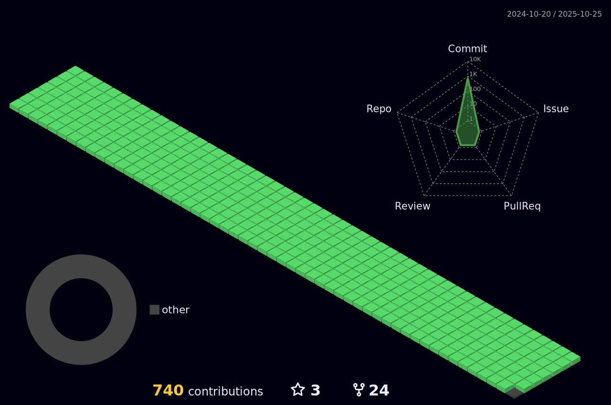

<!-- <body>
  

    <h1> Hi there, I'm Saad Fareed👋<a href="#"></h1>
  

	
 ## Bootcamp alert
- [MLSA Job Hunting Bootcamp](https://github.com/saadfareed/MLSA-Job-Hunting-bootcamp) will started soon.

	
## My Python Development Course 
- [Python Backend Show with Saad Fareed](https://www.youtube.com/channel/UCB5JukXadSvscRtCI0JfGmw)

### I'm a Python Developer, Teacher and Researcher!
- 🔭 I’m currently working as Backend Engineer @Turingcom.
- 🌱 I’m currently expanding my knowledge in DevOps.
- 👯 I’m looking to collaborate with other content creators and developers.
- 📢 Love to teach and inspire students. Taught over more then 500 students.
- 🥅 2022-23 Goals: Contribute more to Open Source projects and Execute my Innovative ideas.
- 💎 If you are a Tech boy/girl let's get connected  
 
<h2>Tech Stack</h2>

<table width="100">
<tr>
    <td align='center' width="200">
        
    </td>

  <td align='center' width="200">
        
    </td>
 <td align='center' width="200">
        
    </td>
 <td align='center' width="200">
        
    </td>
 <td align='center' width="200">
        
    </td>
 
</tr>
 
<tr>
    <td align='center'>
        
    </td>
    <td align='center'>
        
    </td>
 <td align='center'>
        
    </td>
     <td align='center'>
        
    </td>
    <td align='center'>
        
    </td>
</tr>
 
<tr>
    <td align='center'>
        
    </td>
    <td align='center'>
        
    </td>
 <td align='center'>
        
    </td>
  <td align='center'>
        
    </td>
    <td align='center'>
        
    </td>
</tr>
    
</table>

 

 
 

## Personal Projects

|      Project :octocat:   |     Issues :bug:   | Open PRs :bell:  | Closed PRs :fire:  | Last Commit 🚩
|-------------|-------------------|---|---| ----|
| [*Meeting Summarization*](https://github.com/saadfareed/transcript_summary) |  |   |   | |
| [*Github Profile*](https://github.com/saadfareed/saadfareed) |  |   |    | |
| [*Certificate Generator*](https://github.com/saadfareed/Certificate_generator) |  |   |    | |
| [*Leetcode Practice*](https://github.com/saadfareed/Leetcode) |  |   |    | |

	
 
 <h2>GitHub Analytics
 </h2>

  

 
	
## ⚡️Github Contributions
	
<h4 align="center">Isometric view of contributions in the last year</h4>

	

## 🚀Github Metrics

	

 

## 🐛Github Magic Game

  

 
<h2 >🏆 GitHub Profile Trophy</h2>

 
  Views 
  

 -->

<body>
  

    <h1> Hi there, I'm Hassaan Ahmad👋<a href="#"></h1>
  

  
  

<h1 align="center"> Connect with me: </h1>

  

     
    
    <h2>Tech Stack</h2>

<table width="100" align="center">
<tr>
    <td align='center' width="200">
        
    </td>
    <td align='center' width="200">
        
    </td>
    <td align='center' width="200">
        
    </td>
    <td align='center' width="200">
        
    </td>
</tr>
 
<tr>
	<td align='center'>
        
    </td>
    <td align='center'>
        
    </td>
 <td align='center'>
        
    </td>
    <td align='center'>
        
    </td>
</tr>
    
</table>
    
 
<h2 align="center"> Contribution Graph: </h2>

<h2 align="center"><i>⚙ GitHub Analytics:</i></h2>

  <a href="https://github.com/Hassaan0509">
    
     
    </a>
  
   

  

 
<h2 align="center">🏆 GitHub Profile Trophy:</h2>

<h2 align>Spotify Playing 🎧</h2>
    

    
